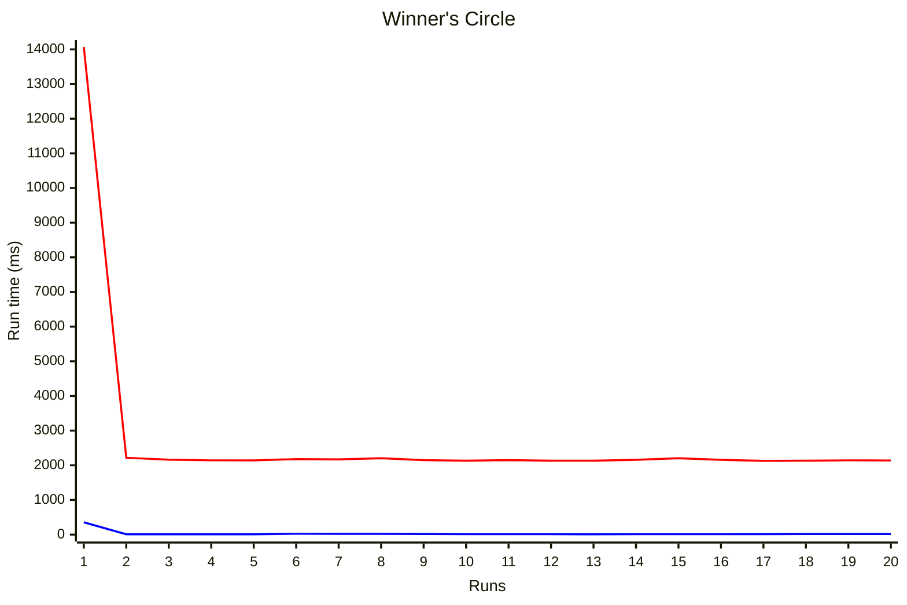

### Flow Designer versus Scripting - RESTMessage performance

### Scenario
Some of our existing ServiceNow outbound REST calls were being made through a Flow Designer action, using an imported RestMessage with OAuth authorization (typical OAuth Application Registry and OAuth Profiles).
This was initially set up since our /oauth/token endpoints were internal and not on the internet and hence had to go through a MID server to access the token endpoint and the REST step in Flow Designer supports that.

Ignoring the above reasons, since this was being triggered by a UI Action button, from a user experience perspective, there was a noticeable delay in calling and running the Flow Designer action. I decided to investigate, from a raw performance perspective, how much faster it would be to use a script instead of a Flow Designer action with a typical REST step.

### Test Conditions

- **Environment**: ServiceNow, Yokohama glide-yokohama-12-18-2024__patch7-hotfix2a-09-24-2025
- **REST mechanism**: Standard ServiceNow Rest Message with a POST method. OAuth authorization through internal /oauth/token endpoint 
- **REST endpoint**: Random Solr queries to a SOLAR endpoint (to minimize any caching server side)
- **Iterations**: 20 runs, average and relative performance reported
- **Measurement**: *Flow Designer* - Before and after calling the Flow Designer action. *Scripting* Before and after calling the script include.


### The fight is on!
**In the <span style="color:#d73a49;">RED</span> corner**, hailing from the sleepy hamlet of Sloth Hollow, in the sovereign state of Molassissippi, weighing in at a bloated 1 subflow and a pipedream… the heavyweight king of visual bloat… FLOOOOOOW DESIGNERRRRR!

**In the <span style="color:#0366d6;">BLUE</span> corner**, the lean, mean fighting machine, coming to us from RapidREST Ranch, in the great state of MinneSoFast, undefeated since 1995… still under 40ms… give it up for SCRIPTY MCSCRIPTFACE!


### Performance Comparison

| Approach             | Average time (ms)  | Relative speed       | Speedup - Times faster  | Inserts (sys_flow*) | Updates (sys_flow*) |
|----------------------|--------------------|----------------------|-------------------------|---------------------|---------------------|
| <span style="color:#d73a49;">Flowwwww Designer</span>    | 2,752.15           | Baseline             | –                       | 260                 |  100                |
| <span style="color:#0366d6;">Scripty McScriptFace</span> | ***30.95***        | ***98.88% faster***  | ***88.92 times faster***|   0                 |    0                |





### Conclusion
Making RESTMessage calls in scripts is **88.92 times faster** than using Flow Designer (2,721.2 ms faster per call).

### Other advantages of using scripting over flow designer
- Much higher **throughput** and much improved **scaleability**
- **You have zero interaction with Flow Designer**
- No overhead of flow engine workers, logging, instances, unnecessary inserts and updates (see above)
- More predictable and reliable executions
- **You have zero interaction with Flow Designer**
- Easier debugging and logging control
- Easier to control and optimize REST Message calls
- **You have zero interaction with Flow Designer**
- Reusable script includes across all applications
- Easier integration with scoped apps and ATF for testing 


### Script Include and RestMessagev2
```javascript
    initialize: function(restMessage, restMessageMethod, requestorId, entityProfile, midServer) {
        // Normalize restMessage to always be a sn_ws.RESTMessageV2 object
        if (typeof restMessage == 'string') {
            // Maintain existing API
            this.restMessage = new sn_ws.RESTMessageV2(restMessage, restMessageMethod);
        } else if (restMessage instanceof sn_ws.RESTMessageV2) {
            // Support anyone passing in an already constructed RESTMessagev2
            this.restMessage = restMessage;
        } else {
            throw 'First argument must be either a REST Message name (string) or a sn_ws.RESTMessageV2 object';
        }        
        // Handle mid server or non-mid server
        let endpoint = this.restMessage.getEndpoint();
        // Change this to however you want to determine whether to go through a midserver for tokens and calls
        this.needMidServer = (endpoint && endpoint.toLowerCase().indexOf('intranet') !== -1);
        if (this.needMidServer) {
            // Go through a midserver for your call if you need it
            this.midServer = midServer || new sn_auth.OAuthMidSelector().selectRESTCapableMidServer('all', null);
            this.restMessage.setMIDServer(this.midServer);
        }
        this.restMessage.setRequestHeader('Authorization', 'Bearer ' + this._getAccessToken(requestorId, entityProfile));
        // Use the existing Rest Message but make sure the authentication is only set by the above
        this.restMessage.setAuthenticationProfile("no_authentication");

    },
    /**SNDOC
        @name _getAccessToken
        @description 
            Gets an OAuth client credentials access token. 
            Support OAuth token endpoints through a MID server
     
        @param {String} [requestorId] - Id of the requestor
        @param {String} [entityProfile] - Id of the entity profile     

        @returns {String} OAuth access token
        */    
     _getAccessToken: function(requestorId, entityProfile) {
        let oAuthClient = new sn_auth.GlideOAuthClient();
        // Get the token. It's cached usually
        let token = oAuthClient.getToken(requestorId, entityProfile);
        // Choose whatever you want for expiration
        if (token.getExpiresIn() < 60) {
            // Use this API to get a new access token
            let tokenRequest = new sn_auth.GlideOAuthClientRequest();
            tokenRequest.setParameter('oauth_requestor_context', 'rest');
            tokenRequest.setParameter('oauth_requestor', requestorId);
            tokenRequest.setParameter('oauth_provider_profile', entityProfile);
            // This is the code that is needed to go through
            // a midserver for internal /oauth/token endpoints
            if (this.needMidServer) {
                // Need this otherwise it can't go through Mid Server
                tokenRequest.setMIDServer(this.midServer);
            }
            let tokenResponse = oAuthClient.requestTokenByRequest(null, tokenRequest);
            token = tokenResponse.getToken();
        }
        return token.getAccessToken();
    },    
    /**SNDOC
        @name invokeRestMessage
        @description Sends in a payload to the Rest Message, executes it and returns the response
    
        @param {String} [payload] - Any payload

        @returns {RESTResponse} Leave it up to the caller to do whatever with the response
    */
    invokeRestMessage: function(payload) {
        // Set the message body (could be JSON or XML or text)
        this.restMessage.setRequestBody(payload);

        return this.restMessage.execute();
    },
    /**SNDOC
        @name invokeRestMessageAsync
        @description 
        Sends in a payload to the Rest Message, executes it and returns the response
        Uses the ECC queue, which is useful for Retry purposes as it supports ECC Retry Policies
        Note that the way this works is that the first try of the REST call to executeAsync 
        returns a proper response. If there's a failure and it matches is a Retry Policy, it will retry and you'll have to
        intercept the response on the ecc_queue (maybe. a business rule)
        @returns {RESTResponse} Leave it up to the caller to do whatever with the first response
        */   
    invokeRestMessageAsync: function(payload) {
        // Set the message body (could be JSON or XML or text)
        this.restMessage.setRequestBody(payload);

        return this.restMessage.executeAsync();
    }
```
### Test Scripts
```javascript
const runs = 20;

/**
 * Script performance check
 */

let oAuthRestUtil = new myscopedapp.OAuthRestUtil('YourRestMessage', 'YourRestMethod', requestorId, entityProfile);
let totalScriptDuration = 0.0;
for (count = 0; count < runs; count++) {
    
    // Grab a random query
    randomIndex = Math.floor(Math.random() * queries.length);
    query = queries[randomIndex];

    let scriptStartTime = new Date().getTime();
    let response = oAuthRestUtil.invokeRestMessage(query);
    let scriptEndTime = new Date().getTime();
    let duration = (scriptEndTime - scriptStartTime);
    gs.info('Scripted duration :' + duration + ' ms ');
    totalScriptDuration += duration;
}

gs.info('----------------------------');
var scriptAverage = (totalScriptDuration / runs);
gs.info('Scripting average ' + scriptAverage);
```
```javascript
const runs = 20;

/**
 * Slow Designer performance check
 */
let totalFDDuration = 0.0;

for (count = 0; count < runs; count++) {

    // Grab a random query
    let randomIndex = Math.floor(Math.random() * queries.length);
    let query = queries[randomIndex];

    let inputs = {
        order_query: query
    };
    let startTime = new Date().getTime();
    let result = sn_fd.FlowAPI.getRunner()
        .action('myRestAction')
        .inForeground()
        .withInputs(inputs)
        .run();
    let endTime = new Date().getTime();
    totalFDDuration += (endTime - startTime);
    gs.info('Flow Designer duration ' + (endTime - startTime) + ' ms');

}
gs.info('----------------------------');
let fdAverage = (totalFDDuration / runs);
gs.info('Flow Designer average ' + fdAverage);
```